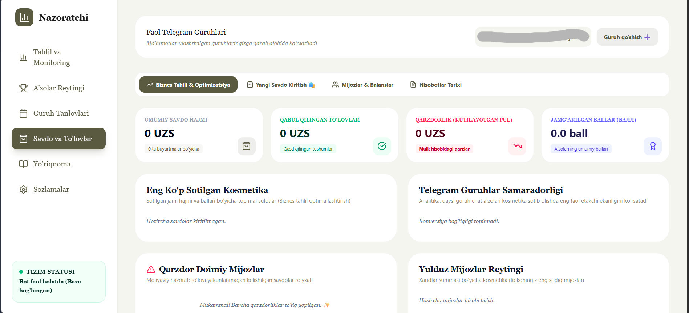
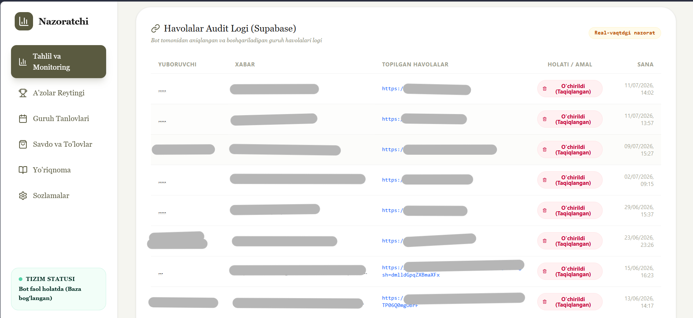
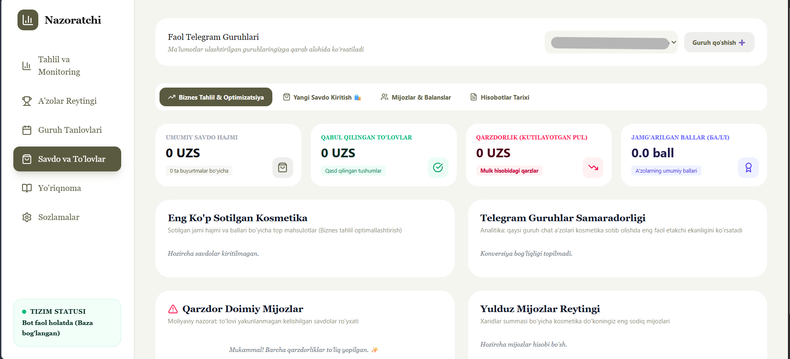

# Bozor Guruhi Nazoratchisi 🚀 (Market Group Supervisor)

**Bozor Guruhi Nazoratchisi** is a high-performance, full-stack Telegram Bot and Business Administration Suite. Designed specifically for regional commercial groups, merchant networks, and group-sales managers (with built-in specialized CRM support for cosmetics brands like **LA'CORE**), this application bridges Telegram's social power with a modern, real-time web administration dashboard.

The project operates as a dual-engine platform:
1. **The Telegram Bot Engine:** Handles real-time group-moderation, member invitations/leaves tracking, link spam cleaning, contest execution, and interactive passwordless administrator authentication.
2. **The Web CRM & Analytics Dashboard:** Provides business owners with comprehensive client logs, product catalogues, interactive sales intakes, partial/full payment tracking, debt tracking (Top Debtors lists), and advanced financial growth metrics.

---

## 📸 Screenshots & Previews

### Admin CRM Dashboard

*Modern web dashboard showing real-time statistics, active contest status, user details, and active members overview.*

### Link Auditing & Anti-Spam Moderation

*Detailed audit logs showing real-time message moderation and unauthorized link removal statistics.*

### Cosmetics Sales Intake & Debts Tracker

*Full CRM ledger showing cosmetics order list, points (Балл) calculations, payment tracking, and outstanding debtor balances.*

---

## 🛠 Core Features

### 1. Growth & Engagement (Contest Engine)
* **Real-Time Referral Verification:** Tracks who added whom (`invites` and `memberships`). It logs when invited members leave, allowing organizers to count only authentic, retained participants.
* **Interactive Leaderboards:** Generates live refer-a-friend leaderboards, encouraging friendly competition among group members to win valuable prizes.
* **Instant Group Synchronization:** Administrators can run `/sync` directly inside their groups to retroactive-scan membership counts and import community data instantly into the relational database.

### 2. Group Protection & Cleanliness (Moderation Engine)
* **Zero-Spam Link Auditing:** Scans group messages in real time, flags unauthorized hyper-links, logs violating users, and deletes spam instantly to protect group members from external marketing or scams.
* **Automated Clean-Up:** Restricts bot-chatter clutter by automatically deleting temporary warning messages and auth receipts after a set timer.

### 3. Passwordless Secure Authentication
* **Bridging DM Auth:** Administrators can request access to the Web Admin dashboard securely and directly from their groups using the `/auth` command.
* **One-Time Password (OTP) Generation:** The bot issues a temporary, encrypted 6-digit access code sent exclusively to the administrator's secure direct messages (DMs). This enables instantaneous, passwordless, and robust authentication for the web administration panel.

### 4. Cosmetics Business CRM & Debt Ledger
* **Point-Value Accounting ("Балл"):** Tailored for cosmetics networks, where products contain both local currency pricing and point values (essential for MLM rank tracking and monthly volume audits).
* **Intelligent Debt & Ledger Flow:** Tracks unpaid, partially paid, and paid invoices, calculating precise debtor outstanding balances and the duration they have been in debt ("debtor since").
* **Rich Data Visualization:** Uses dynamic interactive charts to display sales revenue, payments collected, debts outstanding, and best-selling product categories.

---

## 🛠 Technical Details & Complexities

### The Software Architecture
* **Frontend:** Built with **React 19**, **TypeScript**, and **Vite**. Styling is fully responsive, leveraging **Tailwind CSS**, with elegant micro-interactions and transitions managed by **Motion (framer-motion)**. Data visualisations use high-precision **Recharts** charts.
* **Backend:** Runs on **Node.js** with an **Express** web server and the **Telegraf** bot framework. It features dual-mode boot mechanics (Vite development middleware in local builds, and standalone pre-compiled CommonJS asset serving in production for lightning-fast container cold-starts on Cloud Run).
* **Database:** Powered by **Supabase PostgreSQL** utilizing advanced schema indices, strict foreign-key cascades, and custom constraints.

```
+-------------------------------------------------------------+
|                     CLIENT FRAMEWORK                        |
|                                                             |
|   +-------------+   +---------------+   +---------------+   |
|   |  React 19   |   | Tailwind CSS  |   |   Recharts    |   |
|   +-------------+   +---------------+   +---------------+   |
+------------------------------+------------------------------+
                               |
                        JSON HTTP / API
                               |
                               v
+-------------------------------------------------------------+
|                     EXPRESS API SERVER                      |
|                                                             |
|   +-----------------------+     +-----------------------+   |
|   |    Cosmetics API      |     |     Auth & Stats      |   |
|   +-----------------------+     +-----------------------+   |
+------------------------------+------------------------------+
                               |
                     Supabase DB Client
                               |
                               v
+-------------------------------------------------------------+
|                     DATABASE DIRECTORY                      |
|                                                             |
|   +-----------------------+     +-----------------------+   |
|   |  PostgreSQL Database  |     | Row Level Security    |   |
|   +-----------------------+     +-----------------------+   |
+------------------------------+------------------------------+
                               ^
                               |
                      Real-time Sync/Auth
                               |
+------------------------------+------------------------------+
|                     TELEGRAM BOT ENGINE                     |
|                                                             |
|   +-----------------------+     +-----------------------+   |
|   |  Telegraf Framework   |     | Spam / Join / Leaves  |   |
|   +-----------------------+     +-----------------------+   |
+-------------------------------------------------------------+
```

### Advanced Complexities Addressed

1. **Telegram Multi-Event Mapping:** Mapping Telegram's decentralized events (`chat_member`, `my_chat_member`, `message`) into a strict relational database without missing transition states (such as tracking users who leave the group and then rejoin).
2. **Passwordless Security Loop:** Integrating secure OTP validation between dynamic Telegram sessions and stateless browser HTTP sessions securely without exposing access keys or credentials.
3. **Optimized DB Indices:** Heavy group-chatter can trigger high concurrent write loads. The schema contains optimized indices on active keys (like `idx_memberships_chat_id`, `idx_invites_chat_id`, and `idx_sales_customers_telegram_id`) to maintain microsecond query responses.
4. **State Persistence & RLS:** Employs precise Row Level Security (RLS) policies on Supabase to ensure clean client access while maintaining database integrity.

---

## 🗄 Database Schema Design (`supabase_schema.sql`)

The backend is backed by an efficient, relational PostgreSQL database layout:

* **`groups`**: Directories of monitored Telegram Groups and Supergroups.
* **`users`**: Master registry of all recorded Telegram profiles.
* **`memberships`**: Active and historic records of member state in specific groups, storing `joined_at`, `status` (active/left), `invited_by`, and how many times they have joined (`join_count`).
* **`leaves`**: Tracks historical log events of users exiting the groups.
* **`invites`**: Captures who added whom to attribute referrals correctly during active contests.
* **`link_logs`**: Spam audit trail tracking unapproved external links.
* **`sales_customers`**: CRM directory correlating sales clients with Telegram profiles or mobile numbers.
* **`sales_orders` / `sales_order_items`**: Financial orders mapping quantities, unit prices, and cosmetics points ("Балл").
* **`sales_payments`**: Audit ledger tracking payment collections across Cash, Card, Click, Payme, and bank transfers.

---

## 🤖 Supported Telegram Bot Commands

| Command / Trigger | Target Audience | Functionality |
| :--- | :--- | :--- |
| **`#contest`** | All Group Members | Displays information about the active contest, start/end dates, cash/gift prizes, and rules. |
| **`/auth`** | Group Administrators | Generates a secure, temporary, 6-digit web dashboard verification code. Sent via Telegram Private Messages (DMs) to preserve security. |
| **`/sync`** | Group Administrators | Triggers an immediate, retroactive synchronization. Imports administrator memberships and tallies active members with the official Telegram API. |

---

## ⚙️ Project Setup & Configuration

### Environment Variables (`.env`)

Generate a `.env` file in the root directory and populate it with the following keys:

```env
# The token for your Telegram Bot (created via @BotFather)
TELEGRAM_BOT_TOKEN="YOUR_BOT_TOKEN"

# Your Google Gemini API Key for intelligent auditing
GEMINI_API_KEY="YOUR_GEMINI_API_KEY"

# Public Hosting Application URL
APP_URL="YOUR_APP_URL"

# Supabase API connection parameters
SUPABASE_URL="YOUR_SUPABASE_URL"
SUPABASE_ANON_KEY="YOUR_SUPABASE_ANON_KEY"

# Secure webhook updates token (match with x-telegram-bot-api-secret-token)
TELEGRAM_WEBHOOK_SECRET="YOUR_TELEGRAM_WEBHOOK_SECRET"
```

### Installation

1. **Install Dependencies:**
   ```bash
   npm install
   ```

2. **Run in Development Mode:**
   ```bash
   npm run dev
   ```

3. **Build & Package for Production (Vite + esbuild Bundle):**
   ```bash
   npm run build
   ```

4. **Start Production Service:**
   ```bash
   npm run start
   ```
